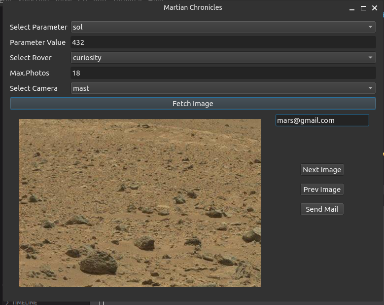

# Martian Chronicles

A Python 3 and PySide6 based GUI application to fetch and display images of Mars from NASA's API based on user parameters and send mail to the user given mail id.


## Table of Contents

- Introduction
- Requirements
- Installation
- Usage
- API Reference
- Contributing
- Support


# Introduction

The Martian Chronicles is a graphical user interface (GUI) application that allows users to browse images of Mars obtained from the NASA Mars Rover API. It allows users to view and mail images taken by the Mars rovers, Curiosity, Opportunity, and Spirit with different cameras on different days.


## Requirements


- Python 3
- PySide6 
- Requests 


## Installation

To install the Martian Chronicles, follow these steps:

Clone or download the repository from GitHub.
Navigate to the root directory of the project in your terminal.
Install the required packages by running the following command:

```bash
 pip or pip3 install -r requirements.txt

```
    
## Usage

To run the Martian Chronicles, navigate to the images directory of the project in your terminal and run the following command:

```javascript
python or python3 main.py
```


## API Reference

The Martian Chronicles uses the NASA Mars Rover Photos API to fetch images of Mars. The API provides a wealth of information about the Mars rovers and their missions, including images, metadata, and mission details.


| Parameter | Type     | Description                |
| :-------- | :------- | :------------------------- |
| `apikey` | `string` | **Required**. Your API key |


## Contributing

Contributions are always welcome!

The Martian Chronicles is an open-source project, and contributions are welcome. If you would like to contribute, please follow these steps:

- Clone or download the repository from GitHub.
- Create a new branch for your changes.
- Make your changes.
- Commit your changes with a descriptive message.
- Push your changes to your branch.
- Create a pull request.

## Support

If you have any questions or issues with the Mars Images Viewer, please open an issue in the GitHub repository.

## 🚀 About Me
I'm a B.Tech CSE student at Amrita Vishwa Vidyapeetham and member  @ amFoss.


## Screenshots



